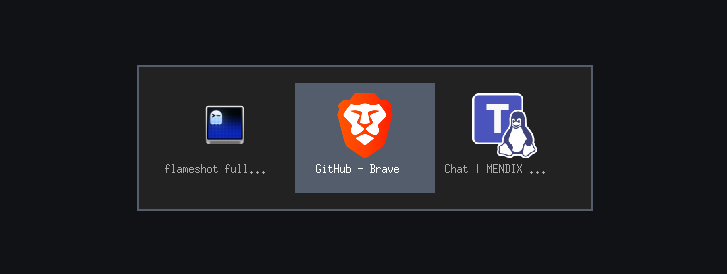

# xwitcher

xwitcher is a lightweight Alt+Tab replacement for X11 written in Rust. It grabs the classic `Alt+Tab` key sequence, shows a custom overlay listing open windows, and lets you pick a target while keeping your most recently used applications at the top. The project focuses on being self-contained, fast, and visually clean while still showing window icons and titles sourced from EWMH metadata or your desktop icon themes.



## Features

- Tracks windows by most recently used order, so repeated `Alt+Tab` oscillates between your last two apps instantly.
- Displays window titles alongside icons pulled from `_NET_WM_ICON`, icon themes, or matching `.desktop` files.
- Works even when some EWMH hints are missing by falling back to other X11 properties or icon directories.
- Draws its own override-redirect overlay window, avoiding interference from compositors or window managers.
- Handles `Alt+Tab`, `Alt+Shift+Tab`, and `Alt+Escape` without hard-coding keycodes, instead mapping the real keys from the X11 server at runtime.

## Requirements

- X11/Xorg session (Wayland requires XWayland support).
- A Rust toolchain (edition 2024) via [rustup](https://rustup.rs/).
- Development headers for X11 if your distribution splits them (e.g. `libx11-dev` on Debian-based systems).

## Building

```bash
cargo build --release
```

The optimized binary will be at `target/release/xwitcher`.

## Installing 

```bash
cargo install --path .
```

## Running

Launch the binary inside your X session:

```bash
xwitcher &
```

The process grabs the keyboard when `Alt`+`Tab` is pressed and keeps running in the background. Press `Ctrl+C` in the launching terminal or kill the process to stop it.

### Layout options

The overlay shows icons in a horizontal strip with labels underneath by default. You can force a specific layout when launching the binary:

```bash
xwitcher --horizontal  # explicit horizontal layout (default)
xwitcher --vertical    # stack entries vertically
```

Short aliases `-h` and `-v` are also supported.

### Styling with CSS

Create a stylesheet at `~/.config/xwitcher/style.css` (or `$XDG_CONFIG_HOME/xwitcher/style.css`) to tweak colours, spacing, and sizing without recompiling. A ready-to-copy template lives in `styles/style.css`. The parser understands a small subset of CSS:

- `:root` custom properties (`--overlay-background`, `--highlight-background`, `--text-color`, `--text-selected-color`, `--overlay-width`, `--padding`, `--screen-margin`, `--row-height`, `--icon-size`, `--icon-margin`, `--vertical-text-gap`, `--vertical-text-baseline`, `--horizontal-item-width`, `--horizontal-item-height`, `--horizontal-text-offset`, `--horizontal-text-baseline`, `--horizontal-char-width`, `--overlay-border-width`, `--overlay-border-color`, `--item-border-width`, `--item-border-color`, `--item-selected-border-color`).
- Element selectors such as `overlay`, `item`, `item:selected`, `label`, `label:selected`, `horizontal`, and `vertical` with the following properties:
  - `overlay { background, width, padding, screen-margin, border-width, border-color }`
  - `item { height, icon-size, icon-margin, border-width, border-color }`
  - `item:selected { background, color, border-color }`
  - `label { color }` and `label:selected { color }`
  - `horizontal { item-width, item-height, text-offset, text-baseline, char-width }`
  - `vertical { text-gap, text-baseline }`

All lengths should be expressed in pixels (e.g. `56px`), and colours accept hex (`#112233`), `rgb()`, or simple names like `white`. For example:

```css
:root {
  --overlay-background: #1a1c1f;
  --highlight-background: #4b90ff;
  --text-color: #dde1f2;
  --text-selected-color: #0c101c;
  --icon-size: 48px;
}

overlay { padding: 20px; }
item:selected { background: #4b90ff; color: #0c101c; }
label { color: #dde1f2; }
horizontal { item-width: 160px; text-offset: 12px; }
```

## Keyboard behaviour

- `Alt+Tab`: cycle forward through the window list.
- `Alt+Shift+Tab`: cycle backward.
- Releasing `Alt`: focus the currently highlighted entry.
- `Alt+Escape`: cancel and keep the original focus.

Because xwitcher registers its own grabs, make sure your window manager or desktop environment does not already intercept the same shortcuts.

## Icon lookup

If a window does not expose an icon via `_NET_WM_ICON`, xwitcher searches standard icon directories such as `~/.icons`, `~/.local/share/icons`, the `XDG_DATA_DIRS` locations, and `/usr/share/pixmaps`. It also parses `.desktop` files in common application directories to map application names or startup classes to icon files. Ensure your icon themes are installed system-wide or per-user if you rely on this fallback.

## Limitations

- Only X11 is supported; running under a pure Wayland compositor is out of scope.
- There is no configuration layer yet—behaviour is currently hard-coded aside from the runtime key lookups.
- Some compositors might still apply focus rules that override the requested target window.
